# 💰 ExpenseWise - Personal Expense Tracker

A full-stack expense tracking application built with React, Node.js, Express, and MySQL. Track your expenses, set budgets, analyze spending patterns, and manage your finances effectively.


## 📋 Table of Contents

- [Features](#-features)
- [Screenshots](#-screenshots)
- [Tech Stack](#-tech-stack)
- [Getting Started](#-getting-started)
- [Installation](#-installation)
- [Environment Variables](#-environment-variables)
- [Database Setup](#-database-setup)
- [Running the Application](#-running-the-application)
- [API Documentation](#-api-documentation)
- [Project Structure](#-project-structure)
- [Contributing](#-contributing)
- [License](#-license)

## ✨ Features

### Core Features
- 🔐 **User Authentication** - Secure signup/login with JWT tokens
- 💳 **Expense & Income Tracking** - Add, edit, delete expenses and income
- 🏦 **Bank Account Management** - Multiple accounts with balance tracking
- 🔄 **Recurring Transactions** - Auto-add monthly salary/expenses
- 📊 **Budget Tracking** - Set monthly budgets with visual progress indicators
- 🔍 **Search & Filter** - Find expenses by description, category, or amount
- 📱 **Responsive Design** - Works seamlessly on desktop, tablet, and mobile
- 🌓 **Dark/Light Theme** - Toggle between themes (Premium feature)
- 🛡️ **Rate Limiting** - Arcjet protection against abuse

### Premium Features
- ⭐ **Premium Membership** - Razorpay payment integration (₹499)
- 📈 **Advanced Analytics** - Daily, weekly, monthly expense trends
- 📊 **Category Breakdown** - Visual pie charts of spending by category
- 🏆 **Leaderboard** - Compare spending with other premium users
- 📥 **PDF Export** - Download detailed expense reports
- 🤖 **AI Receipt Scanner** - Auto-fill expenses from receipt images
- 📧 **Monthly Email Reports** - AI-powered financial insights via email

### Additional Features
- 👤 **Profile Management** - Update personal info and upload profile photo
- 🔄 **Real-time Updates** - Optimistic UI updates for instant feedback
- 📧 **Password Reset** - Email-based password recovery via Brevo
- 💾 **Transaction Safety** - Database transactions ensure data consistency
- 🔔 **Toast Notifications** - User-friendly feedback messages
- 📅 **Date-based Tracking** - Track expenses by specific dates
- 📝 **Notes & Comments** - Add notes to transactions
- 🎯 **Budget Alerts** - Visual warnings when approaching budget limits

## 📸 Screenshots
### Landing Page - Hero Section
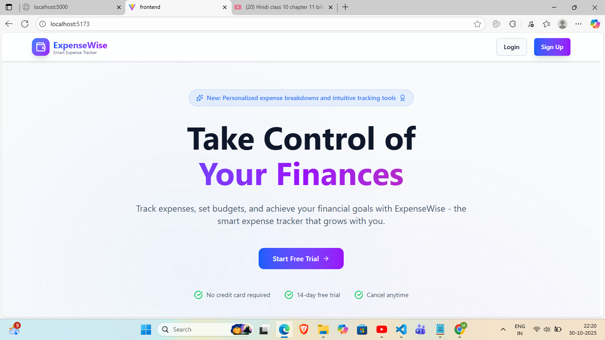  
Beautiful hero section with call-to-action and feature highlights

### Landing Page - Features
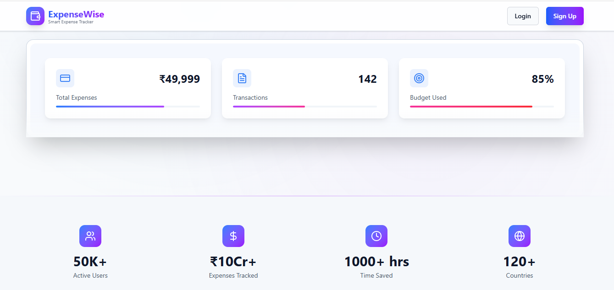  
Comprehensive feature showcase with icons and descriptions

### Landing Page - Pricing
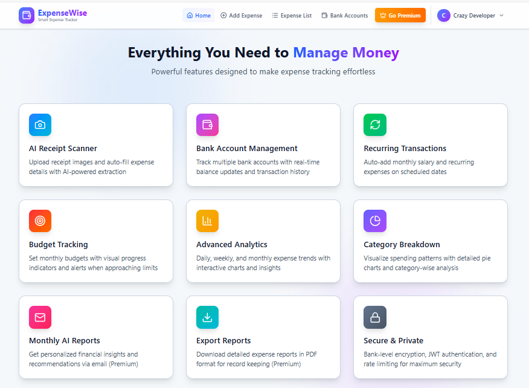  
Transparent pricing plans with feature comparison

### Add Expense
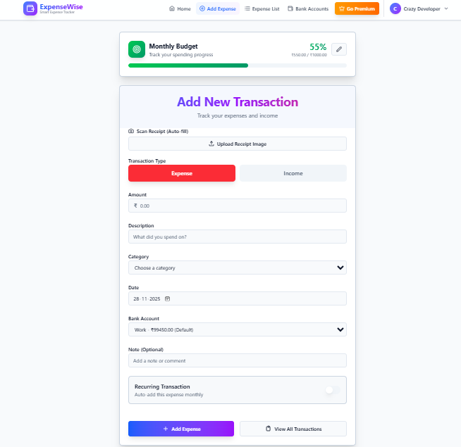  
Simple and intuitive expense entry form with budget indicator

### Expense List
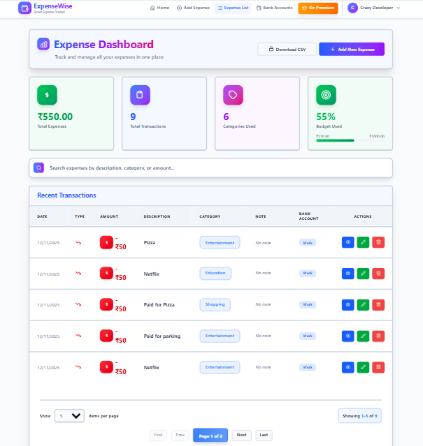  
View all expenses with search, filter, and pagination

### Premium Features
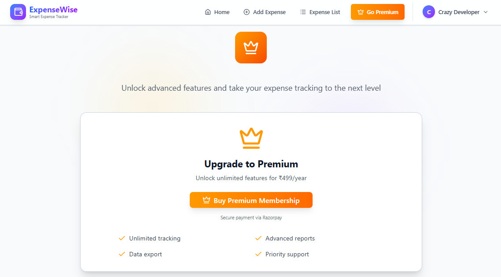  
Premium membership page with Razorpay integration

### Profile Page
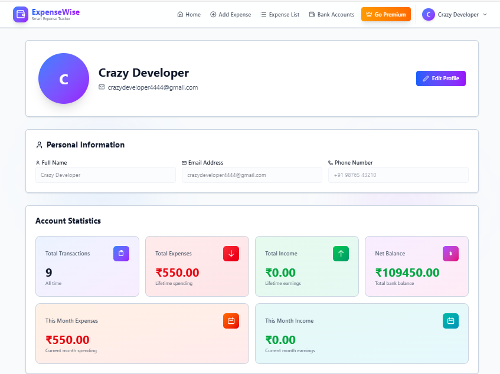  
User profile with statistics and photo upload

### Unlocked Premium Features
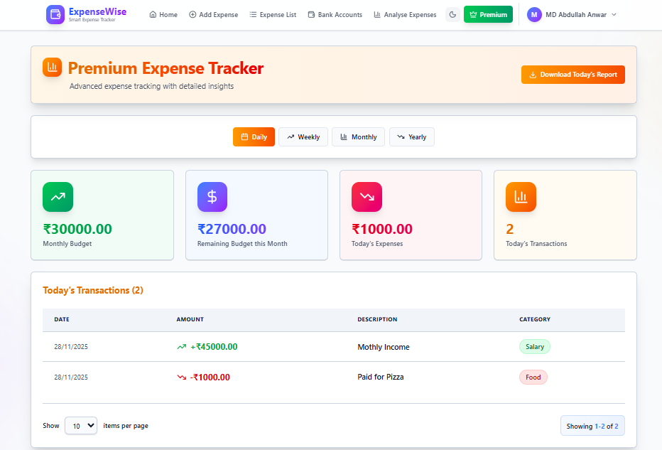  
Premium membership page unlocked with Transaction breakdown days, weekly and monthly spending with pagination and Expense Report PDF Export

### Expense Analysis
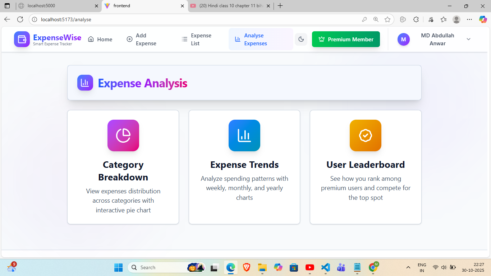  
Comprehensive expense Category Breakdown, Expense Trends and Leaderboard comes in Premium membership

### Category Breakdown
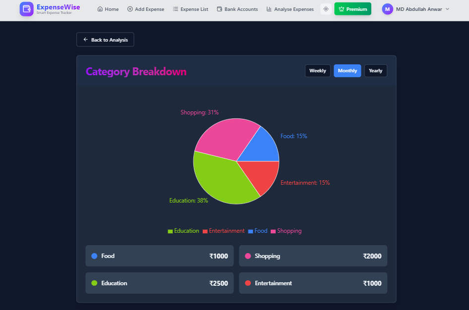  
Pie chart showing expense distribution by category

### Expense Trends
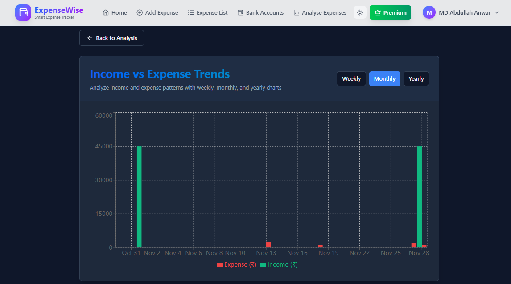  
Visual analytics with charts and spending trends daily, weekly and monthly

### User Leaderboard
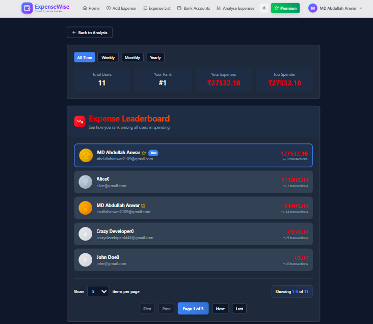  
Top spenders list - See how you rank among all users and compete for the top spot

### Dark Mode
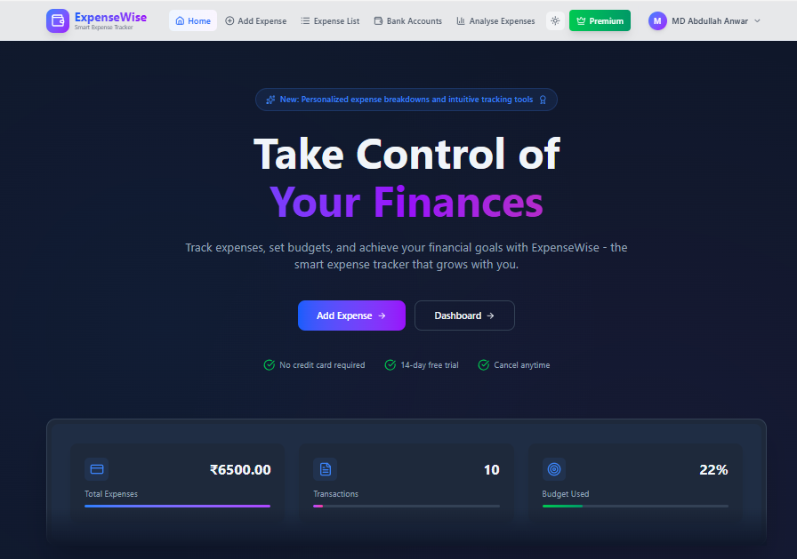  
Beautiful dark theme for comfortable viewing

## 🛠 Tech Stack

### Frontend
- **React 18** - UI library
- **Vite** - Build tool and dev server
- **Redux Toolkit** - State management
- **React Router v6** - Client-side routing
- **Axios** - HTTP client
- **Tailwind CSS** - Utility-first CSS framework
- **Lucide React** - Icon library

### Backend
- **Node.js** - Runtime environment
- **Express.js** - Web framework
- **MySQL** - Relational database
- **Sequelize** - ORM for MySQL
- **JWT** - Authentication tokens
- **Bcrypt** - Password hashing
- **Razorpay** - Payment gateway
- **Brevo (Sendinblue)** - Email service
- **Arcjet** - Rate limiting & security
- **Node-cron** - Scheduled tasks
- **Axios** - HTTP client for AI APIs
- **OpenRouter** - AI model access (GPT-4o-mini, Llama 3.2)
- **Zod** - Schema validation

## 🚀 Getting Started

### Prerequisites

- Node.js (v14 or higher)
- MySQL (v8 or higher)
- npm or yarn
- Razorpay account (for premium features)
- Brevo account (for email service - FREE tier available)
- OpenRouter API key (for AI features - FREE tier available)
- Arcjet API key (for rate limiting - FREE tier available)

## 📦 Installation

### 1. Clone the Repository

```bash
git clone https://github.com/yourusername/expense-tracker.git
cd expense-tracker
```

### 2. Install Backend Dependencies

```bash
cd Backend
npm install
```

### 3. Install Frontend Dependencies

```bash
cd ../Frontend
npm install
```

## 🔧 Environment Variables

### Backend (.env)

Create a `.env` file in the `Backend` directory:

```env
# Server Configuration
PORT=5000
NODE_ENV=development

# Database Configuration
DB_NAME=expense_tracker
DB_USER=root
DB_PASSWORD=your_password
DB_HOST=localhost

# JWT Secret
JWT_SECRET=your_super_secret_jwt_key_here

# Razorpay Configuration
RAZORPAY_KEY_ID=your_razorpay_key_id
RAZORPAY_KEY_SECRET=your_razorpay_secret

# Email Configuration (Brevo)
BREVO_API_KEY=your_brevo_api_key
BREVO_SENDER_EMAIL=your_email@example.com

# Frontend URL
FRONTEND_URL=http://localhost:5173

# Arcjet Configuration
ARCJET_KEY=your_arcjet_api_key
ARCJET_ENV=development

# AI Configuration (OpenRouter)
GEMINI_API_KEY=your_openrouter_api_key
```

### Frontend (.env)

Create a `.env` file in the `Frontend` directory:

```env
VITE_API_URL=http://localhost:5000
```

## 🗄 Database Setup

### 1. Create Database

```sql
CREATE DATABASE expense_tracker;
```

### 2. Run Migrations

```bash
cd Backend
npx sequelize-cli db:migrate
```

This will create the following tables:
- Users
- Expenses
- Orders
- ForgotPasswordRequests
- BankAccounts

### 3. Run Migration Script (Optional)

```bash
node scripts/migrateUserTotals.js
```

This populates user totals for existing data.

## ▶️ Running the Application

### Start Backend Server

```bash
cd Backend
npm run dev
```

Backend runs on `http://localhost:5000`

### Start Frontend Development Server

```bash
cd Frontend
npm run dev
```

Frontend runs on `http://localhost:5173`

### Access the Application

Open your browser and navigate to `http://localhost:5173`

## 📚 API Documentation

### Authentication Endpoints

#### POST /user/signup
Register a new user
```json
{
  "name": "John Doe",
  "email": "john@example.com",
  "password": "password123"
}
```

#### POST /user/login
Login user
```json
{
  "email": "john@example.com",
  "password": "password123"
}
```

### Expense Endpoints

#### GET /expense
Get all expenses (requires authentication)

#### POST /expense/add
Add new expense or income
```json
{
  "amount": 500,
  "description": "Groceries",
  "category": "Food",
  "note": "Weekly shopping",
  "expenseDate": "2024-01-15",
  "type": "expense",
  "BankAccountId": 1,
  "isRecurring": false,
  "recurringDay": null
}
```

#### POST /expense/scan-receipt
Scan receipt image and extract data (AI-powered)
```json
{
  "image": "data:image/jpeg;base64,..."
}
```

#### PUT /expense/:id
Update expense

#### DELETE /expense/:id
Delete expense

### Premium Endpoints

#### POST /payment/create-order
Create Razorpay order

#### POST /payment/verify
Verify payment and activate premium

### Profile Endpoints

#### PUT /user/profile
Update user profile
```json
{
  "name": "John Doe",
  "email": "john@example.com",
  "phone": "+91 9876543210",
  "profilePhoto": "base64_encoded_image"
}
```

#### PUT /user/budget
Update monthly budget
```json
{
  "monthlyBudget": 50000
}
```

### Bank Account Endpoints

#### GET /bank-account
Get all bank accounts

#### POST /bank-account
Create new bank account
```json
{
  "name": "HDFC Savings",
  "balance": 50000,
  "isDefault": true
}
```

#### PUT /bank-account/:id
Update bank account

#### DELETE /bank-account/:id
Delete bank account

### Password Reset Endpoints

#### POST /password/forgot-password
Request password reset
```json
{
  "email": "john@example.com"
}
```

#### POST /password/reset-password/:token
Reset password with token
```json
{
  "password": "newpassword123"
}
```

## 🤖 AI Features

### Receipt Scanner
- **Upload receipt images** to auto-fill expense forms
- **Extracts:** Amount, Description, Category, Date
- **Powered by:** GPT-4o-mini via OpenRouter
- **Location:** Available on `/expenses` page

### Monthly Email Reports (Premium Only)
- **Automatic:** Sent on 1st of every month at 9 AM IST
- **Includes:**
  - Monthly income summary
  - Category-wise spending breakdown (₹ and %)
  - AI-generated financial insights (3 actionable tips)
- **Powered by:** Llama 3.2 via OpenRouter
- **Delivered via:** Brevo email service

## 🏦 Bank Account Features

- **Multiple Accounts:** Track expenses across different bank accounts
- **Balance Tracking:** Real-time balance updates with transactions
- **Default Account:** Set a default account for quick expense entry
- **Account Management:** Add, edit, delete bank accounts
- **Transaction History:** View all transactions per account

## 🔄 Recurring Transactions

- **Monthly Salary:** Auto-credit salary on specified day
- **Recurring Expenses:** Auto-add monthly bills (rent, subscriptions)
- **Flexible Scheduling:** Set any day (1-28) of the month
- **Automatic Processing:** Cron job runs daily to process due transactions

## 🛡️ Security Features

- **JWT Authentication:** Secure token-based auth
- **Password Hashing:** Bcrypt with salt rounds
- **Rate Limiting:** Arcjet protection (5 requests/10 seconds for expenses)
- **Input Validation:** Zod schema validation
- **SQL Injection Protection:** Sequelize ORM parameterized queries
- **CORS Configuration:** Controlled cross-origin access

## 📧 Email Features

- **Password Reset:** Secure token-based password recovery
- **Monthly Reports:** AI-powered financial insights (Premium)
- **Transaction Notifications:** Optional email alerts
- **Brevo Integration:** Reliable email delivery (300 emails/day free)

## 📁 Project Structure

```
expense-tracker/
├── Backend/
│   ├── config/              # Database and app configuration
│   ├── controllers/         # Request handlers
│   ├── services/           # Business logic
│   ├── models/             # Sequelize models
│   ├── routes/             # API routes
│   ├── middlewares/        # Auth, validation, rate limiting
│   ├── validators/         # Zod schemas
│   ├── migrations/         # Database migrations
│   ├── scripts/            # Utility scripts
│   ├── docs/               # Backend documentation
│   ├── .env                # Production environment variables
│   ├── .env.local          # Local development environment variables
│   ├── server.js           # Entry point
│   └── package.json
│
├── Frontend/
│   ├── src/
│   │   ├── assets/        # Static assets
│   │   │   └── react.svg
│   │   ├── components/     # React components
│   │   │   ├── layout/    # Layout components
│   │   │   │   ├── Footer.jsx
│   │   │   │   ├── Header.jsx
│   │   │   │   └── Layout.jsx
│   │   │   ├── pages/     # Page components
│   │   │   │   ├── analyse/      # Analytics pages
│   │   │   │   │   ├── AnalysePage.jsx
│   │   │   │   │   ├── CategoryBreakdown.jsx
│   │   │   │   │   ├── ExpenseTrends.jsx
│   │   │   │   │   └── Leaderboard.jsx
│   │   │   │   ├── bankAccount/  # Bank account management
│   │   │   │   │   └── BankAccountPage.jsx
│   │   │   │   ├── expense/      # Expense management pages
│   │   │   │   │   ├── ExpenseDetailModal.jsx
│   │   │   │   │   ├── ExpenseListPage.jsx
│   │   │   │   │   └── ExpensePage.jsx
│   │   │   │   ├── forms/        # Auth forms
│   │   │   │   │   ├── ForgotPasswordForm.jsx
│   │   │   │   │   ├── LoginForm.jsx
│   │   │   │   │   ├── ResetPasswordForm.jsx
│   │   │   │   │   └── SignupForm.jsx
│   │   │   │   ├── landing/      # Landing page
│   │   │   │   │   └── LandingPage.jsx
│   │   │   │   ├── premium/      # Premium features pages
│   │   │   │   │   ├── PremiumExpenseTracker.jsx
│   │   │   │   │   ├── PremiumPage.jsx
│   │   │   │   │   └── PremiumPurchase.jsx
│   │   │   │   └── profile/      # User profile page
│   │   │   │       └── ProfilePage.jsx
│   │   │   └── ui/        # Reusable UI components
│   │   │       ├── badge.jsx
│   │   │       ├── button.jsx
│   │   │       ├── card.jsx
│   │   │       ├── input.jsx
│   │   │       ├── label.jsx
│   │   │       ├── Pagination.jsx
│   │   │       └── toast.jsx
│   │   ├── config/        # Configuration files
│   │   │   └── config.js  # API URL configuration
│   │   ├── constants/     # Constants
│   │   │   ├── api/       # API constants
│   │   │   │   └── auth.js
│   │   │   └── message.js # Message constants
│   │   ├── context/       # React contexts
│   │   │   └── ThemeContext.jsx
│   │   ├── hooks/         # Custom hooks
│   │   │   └── usePagination.js
│   │   ├── lib/           # Utilities
│   │   │   └── utils.js
│   │   ├── store/         # Redux store
│   │   │   ├── store.js
│   │   │   └── userSlice.js
│   │   ├── utils/         # Utilities
│   │   │   ├── api/       # Centralized API calls
│   │   │   │   ├── auth/         # Auth API calls
│   │   │   │   │   ├── forgotPassword.js
│   │   │   │   │   ├── index.js
│   │   │   │   │   ├── login.js
│   │   │   │   │   ├── register.js
│   │   │   │   │   └── resetPassword.js
│   │   │   │   ├── bankAccount/  # Bank account API calls
│   │   │   │   │   ├── createAccount.js
│   │   │   │   │   ├── deleteAccount.js
│   │   │   │   │   ├── getAllAccounts.js
│   │   │   │   │   └── index.js
│   │   │   │   ├── expense/      # Expense API calls
│   │   │   │   │   ├── createExpense.js
│   │   │   │   │   ├── deleteExpense.js
│   │   │   │   │   ├── getAllExpenses.js
│   │   │   │   │   ├── index.js
│   │   │   │   │   └── updateExpense.js
│   │   │   │   ├── premium/      # Premium API calls
│   │   │   │   │   ├── downloadExpenses.js
│   │   │   │   │   ├── getLeaderboard.js
│   │   │   │   │   ├── index.js
│   │   │   │   │   ├── purchasePremium.js
│   │   │   │   │   └── updateTransaction.js
│   │   │   │   ├── profile/      # Profile API calls
│   │   │   │   │   ├── getStats.js
│   │   │   │   │   ├── index.js
│   │   │   │   │   └── updateBudget.js
│   │   │   │   └── index.js      # Main API export
│   │   │   ├── api.js     # Request handler (axios wrapper)
│   │   │   └── validateForm.js
│   │   ├── App.css        # App styles
│   │   ├── App.jsx        # Main app component
│   │   ├── index.css      # Global styles
│   │   └── main.jsx       # Entry point
│   ├── docs/              # Frontend documentation
│   ├── .env               # Production environment variables
│   ├── .env.local         # Local development environment variables
│   ├── vite.config.js     # Vite configuration
│   └── package.json
│
├── screenshots/           # Application screenshots
├── README.md             # This file
└── LICENSE               # MIT License
```

## 🎯 Key Features Explained

### Budget Tracking
Set a monthly budget and track your spending in real-time. Visual indicators show:
- Green: Under 60% of budget
- Yellow: 60-80% of budget
- Orange: 80-100% of budget
- Red: Over budget

### Transaction Safety
All database operations use transactions to ensure:
- Atomicity: Operations complete fully or not at all
- Consistency: Data remains valid
- Isolation: Concurrent operations don't interfere
- Durability: Committed changes persist

### Optimistic Updates
The UI updates immediately when you:
- Add an expense
- Edit an expense
- Delete an expense

If the operation fails, changes are automatically reverted.

### Premium Membership
Unlock advanced features with a one-time payment of ₹499:
- Advanced analytics and trends
- Category breakdown charts
- Leaderboard access
- CSV export functionality
- Dark/Light theme toggle

## 🔒 Security Features

- JWT-based authentication with 1-hour token expiry
- Bcrypt password hashing with salt rounds
- SQL injection prevention via Sequelize ORM
- XSS protection with React's built-in escaping
- CORS configuration for API security
- Environment variables for sensitive data
- Auto-logout on token expiration

## 🧪 Testing

### Backend Tests
```bash
cd Backend
npm test
```

### Frontend Tests
```bash
cd Frontend
npm test
```

## 📈 Performance

- Lazy loading for route-based code splitting
- Optimized bundle size with Vite
- Database connection pooling
- Efficient state management with Redux
- Pagination for large datasets
- Image optimization for profile photos

## 🤝 Contributing

Contributions are welcome! Please follow these steps:

1. Fork the repository
2. Create a feature branch (`git checkout -b feature/AmazingFeature`)
3. Commit your changes (`git commit -m 'Add some AmazingFeature'`)
4. Push to the branch (`git push origin feature/AmazingFeature`)
5. Open a Pull Request

## 📝 License

This project is licensed under the MIT License - see the [LICENSE](LICENSE) file for details.

## 👨‍💻 Author

**Your Name**
- GitHub: [@MdAbdullahAnwar](https://github.com/MdAbdullahAnwar)
- Email: crazydeveloper4444@gmail.com

## 🙏 Acknowledgments

- React team for the amazing library
- Express.js for the robust backend framework
- Tailwind CSS for the utility-first CSS framework
- Razorpay for payment integration
- All open-source contributors

## 📞 Support

For support, email crazydeveloper4444@gmail.com or open an issue on GitHub.

## 🗺 Roadmap

- [ ] Mobile app (React Native)
- [ ] Recurring expenses
- [ ] Multi-currency support
- [ ] Expense categories customization
- [ ] Budget alerts via email/SMS
- [ ] Export to PDF
- [ ] Expense sharing with family
- [ ] AI-powered spending insights
- [ ] Bank account integration
- [ ] Receipt scanning with OCR

---

Made with ❤️ by [MD Abdullah Anwar](https://github.com/MdAbdullahAnwar)